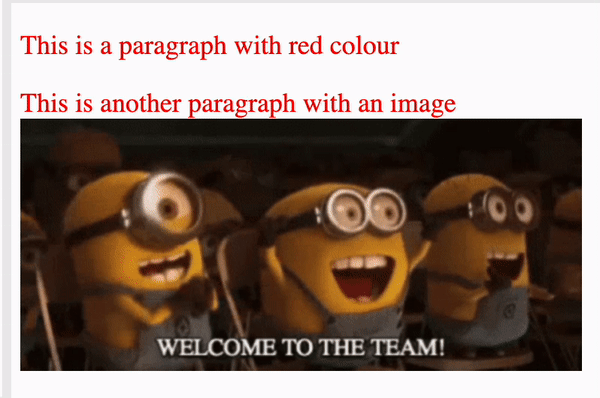

# Catch and fix the error  
This piece of code has 2 paragraphs; the first paragraph is in red color while the second paragraph contains an image. However, the color and image doesn't show. Your goal is to identify what is wrong with the code and fix it. 

Use the following hint as a guide to attempt the exercise
  
  ## Hints
  1. Work together as a team on the exercise.
  2. Run the code as it is to see the output.
  3. check the `index.html` and `style.css` file to check for possible errors.
  4. fix the error(s) you've discovered.
  5. choose 1 person within the team to discuss your findings and workaround.

If you're able to catch all the bugs and fix them, your page should look like the one below

  
  
  